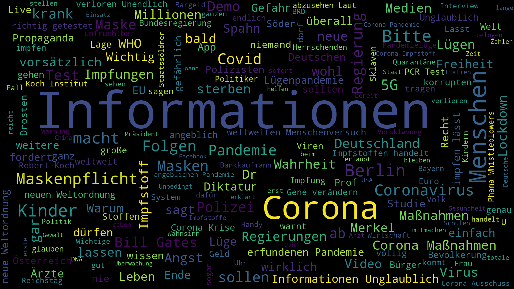

# Telegram Analysis

Data-Science project telegram channels.

``data science - telegram - jupyter - text-mining - text-classification``

Author: [Maximilian Bundscherer](https://bundscherer-online.de)

**I still have things to do... / Work in progress**

## Overview

- Processed Jupyter Notebook [included](./notebooks/Telegram.ipynb) (you can see it through the GitHub preview)

### Let's get started

1. Add downloaded telegram-data in ``./notebooks/data/`` (you can download telegram conversations from official telegram-computer-client -> Export Channel to json)
2. Wire downloaded telegram-data in ``./notebooks/inputFiles.csv`` ([go to file](./notebooks/inputFiles.csv))
3. Run Jupyter Notebook (Docker recommend ``docker run --rm -p 8888:8888 --name web -v <LOCAL_REPO_PATH>:/home/jovyan/work jupyter/datascience-notebook``)
