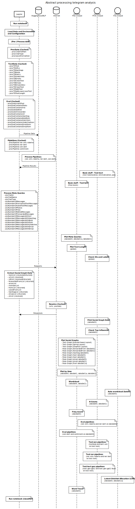

# Excerpt Telegram Analysis

``data science - telegram - jupyter - text-mining - text-classification``

Author: [Maximilian Bundscherer](https://bundscherer-online.de)

- Go to [GitHub-Repository and Let's get started](https://github.com/maxbundscherer/telegram-analysis)
- Go to [raw jupyter-notebook (file)](https://github.com/maxbundscherer/telegram-analysis/blob/master/notebooks/Telegram.ipynb)
- Go to [processed jupyter-notebook (preview)](https://nbviewer.jupyter.org/github/maxbundscherer/telegram-analysis/blob/master/notebooks/Telegram-out.ipynb)

## Table of contents

* TOC
{:toc}

## Sequence diagram jupyter notebook

## Meta

### Overview

**DataSet0**

**DataSet1a**

**DataSet2**

### Number of messages

**DataSet0**

**DataSet1a**

**DataSet2**

### Text Length

**Global**

## Graphs

### Forwarded From

**DataSet0**

**DataSet2**

### Hashtags

**DataSet0**

### Hosts

**DataSet0**

**DataSet2**

### Emojis

**DataSet0**

**DataSet2**

### From

**DataSet1a**

## Latent Dirichlet Allocation

**Oliver Janich**

- [Channel Oliver Janich (2 Topics)](https://maxbundscherer.github.io/telegram-analysis/topics/oliver-janich-t-2-report.html)
- [Channel Oliver Janich (4 Topics)](https://maxbundscherer.github.io/telegram-analysis/topics/oliver-janich-t-4-report.html)
- [Channel Oliver Janich (8 Topics)](https://maxbundscherer.github.io/telegram-analysis/topics/oliver-janich-t-8-report.html)
- [Channel Oliver Janich (16 Topics)](https://maxbundscherer.github.io/telegram-analysis/topics/oliver-janich-t-16-report.html)

**Attila Hildmann**

- [Channel Attila Hildmann (2 Topics)](https://maxbundscherer.github.io/telegram-analysis/topics/attila-hildmann-t-2-report.html)
- [Channel Attila Hildmann (4 Topics)](https://maxbundscherer.github.io/telegram-analysis/topics/attila-hildmann-t-4-report.html)
- [Channel Attila Hildmann (8 Topics)](https://maxbundscherer.github.io/telegram-analysis/topics/attila-hildmann-t-8-report.html)
- [Channel Attila Hildmann (16 Topics)](https://maxbundscherer.github.io/telegram-analysis/topics/attila-hildmann-t-16-report.html)

**Eva Herman**

- [Channel Eva Herman (2 Topics)](https://maxbundscherer.github.io/telegram-analysis/topics/eva-herman-t-2-report.html)
- [Channel Eva Herman (4 Topics)](https://maxbundscherer.github.io/telegram-analysis/topics/eva-herman-t-4-report.html)
- [Channel Eva Herman (8 Topics)](https://maxbundscherer.github.io/telegram-analysis/topics/eva-herman-t-8-report.html)
- [Channel Eva Herman (16 Topics)](https://maxbundscherer.github.io/telegram-analysis/topics/eva-herman-t-16-report.html)

**Xavier Naidoo**

- [Channel Xavier Naidoo (2 Topics)](https://maxbundscherer.github.io/telegram-analysis/topics/xavier-naidoo-t-2-report.html)
- [Channel Xavier Naidoo (4 Topics)](https://maxbundscherer.github.io/telegram-analysis/topics/xavier-naidoo-t-4-report.html)
- [Channel Xavier Naidoo (8 Topics)](https://maxbundscherer.github.io/telegram-analysis/topics/xavier-naidoo-t-8-report.html)
- [Channel Xavier Naidoo (16 Topics)](https://maxbundscherer.github.io/telegram-analysis/topics/xavier-naidoo-t-16-report.html)

**FREIHEITS-CHAT**

- [Group FREIHEITS-CHAT (2 Topics)](https://maxbundscherer.github.io/telegram-analysis/topics/group-freiheitsChat-t-2-report.html)
- [Group FREIHEITS-CHAT (4 Topics)](https://maxbundscherer.github.io/telegram-analysis/topics/group-freiheitsChat-t-4-report.html)
- [Group FREIHEITS-CHAT (8 Topics)](https://maxbundscherer.github.io/telegram-analysis/topics/group-freiheitsChat-t-8-report.html)
- [Group FREIHEITS-CHAT (16 Topics)](https://maxbundscherer.github.io/telegram-analysis/topics/group-freiheitsChat-t-16-report.html)
- [Group FREIHEITS-CHAT (32 Topics)](https://maxbundscherer.github.io/telegram-analysis/topics/group-freiheitsChat-t-32-report.html)

**FREIHEITSCHATZ - BLITZ**

- [Group FREIHEITSCHAT - BLITZ (2 Topics)](https://maxbundscherer.github.io/telegram-analysis/topics/group-freiheitsChatBlitz-t-2-report.html)
- [Group FREIHEITSCHAT - BLITZ (4 Topics)](https://maxbundscherer.github.io/telegram-analysis/topics/group-freiheitsChatBlitz-t-4-report.html)
- [Group FREIHEITSCHAT - BLITZ (8 Topics)](https://maxbundscherer.github.io/telegram-analysis/topics/group-freiheitsChatBlitz-t-8-report.html)
- [Group FREIHEITSCHAT - BLITZ (16 Topics)](https://maxbundscherer.github.io/telegram-analysis/topics/group-freiheitsChatBlitz-t-16-report.html)
- [Group FREIHEITSCHAT - BLITZ (32 Topics)](https://maxbundscherer.github.io/telegram-analysis/topics/group-freiheitsChatBlitz-t-32-report.html)

**Livestreaming für Deutschland, Österreich ...**

- [Group Livestreaming für Deutschland, Österreich ... (2 Topics)](https://maxbundscherer.github.io/telegram-analysis/topics/group-liveFuerDeOsSc-t-2-report.html)
- [Group Livestreaming für Deutschland, Österreich ... (4 Topics)](https://maxbundscherer.github.io/telegram-analysis/topics/group-liveFuerDeOsSc-t-4-report.html)
- [Group Livestreaming für Deutschland, Österreich ... (8 Topics)](https://maxbundscherer.github.io/telegram-analysis/topics/group-liveFuerDeOsSc-t-8-report.html)
- [Group Livestreaming für Deutschland, Österreich ... (16 Topics)](https://maxbundscherer.github.io/telegram-analysis/topics/group-liveFuerDeOsSc-t-16-report.html)
- [Group Livestreaming für Deutschland, Österreich ... (32 Topics)](https://maxbundscherer.github.io/telegram-analysis/topics/group-liveFuerDeOsSc-t-32-report.html)

## Word Tracer

### Channel Oliver Janich (DataSet0)

### Channel Attila Hildmann (DataSet0)

### Channel Eva Herman (DataSet0)

### Channel Xavier Naidoo (DataSet0)

## Freq Nouns

### Channel Oliver Janich (DataSet0)

### Channel Attila Hildmann (DataSet0)

### Channel Eva Herman (DataSet0)

### Channel Xavier Naidoo (DataSet0)

## Evaluation SEN

**DataSet0**

## Evaluation SEN-Pipeline (Bert)

**DataSet0**

## Auto Word Clouds
<!-- Slider -->
<link rel="stylesheet" type="text/css" href="https://cdn.jsdelivr.net/npm/slick-carousel@1.8.1/slick/slick.css"/>

<!-- CSV -->

<!-- Slider Gen -->

### WordCloud Oliver Janich (Channel - DataSet0)
<!-- Sliders -->

### WordCloud Attila Hildmann (Channel - DataSet0)
<!-- Sliders -->

### WordCloud Eva Herman (Channel - DataSet0)
<!-- Sliders -->

### WordCloud Xavier Naidoo (Channel - DataSet0)
<!-- Sliders -->

<!-- Global site tag (gtag.js) - Google Analytics -->

